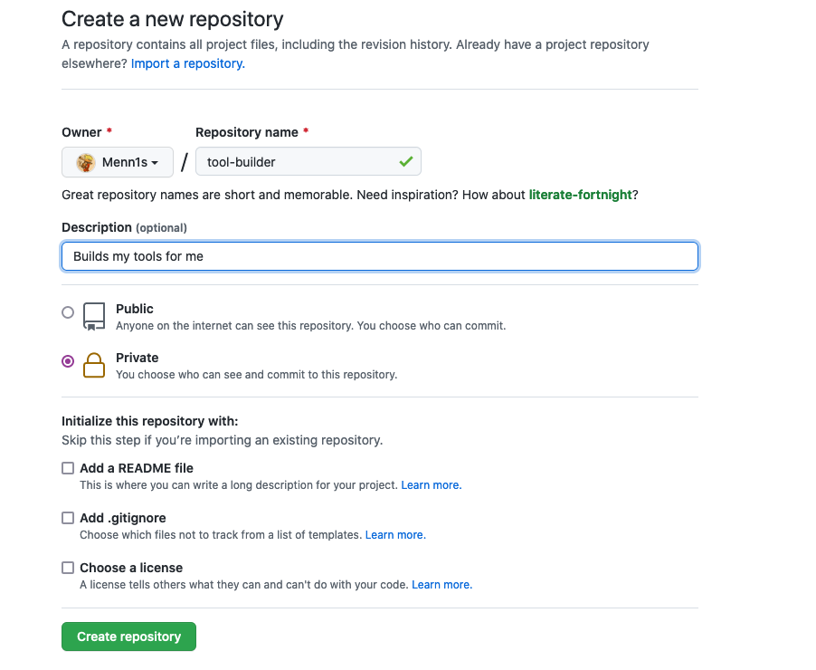
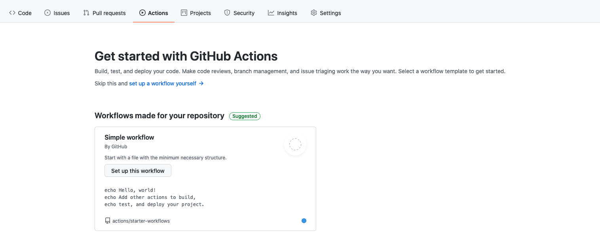
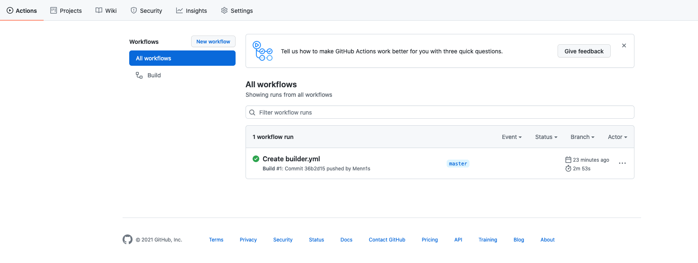
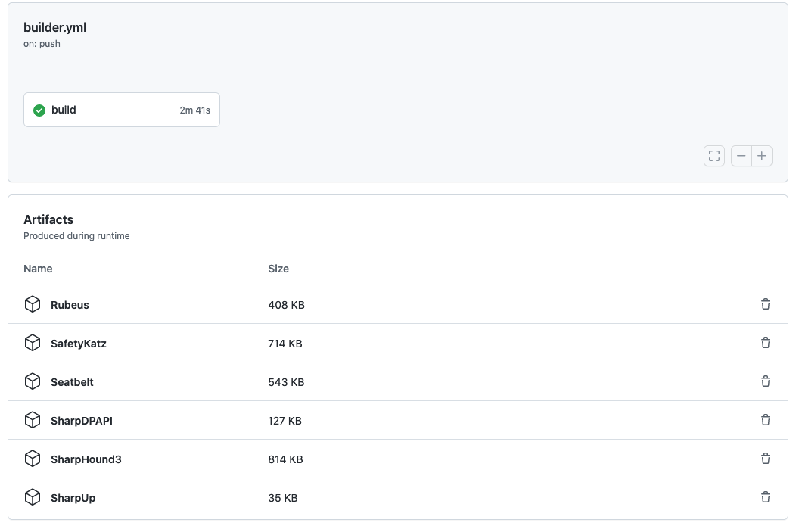

# Github Actions for Red Team Tools

The usual way to generate red team tools (many C# post-exploit tools) would involve downloading the individual tool from Github, then compiling. On Windows, this was especially tough for me because sometimes the Visual Studio environment would break or it simply involved the extra step of starting a VM. Then there were issues with outdated Git repos and outdated binaries. 

To get around this and to have Github Actions take care of pretty much all the compiling, I setup an repository that would take care of it. I made heavy reference to and tried to follow [this](https://medium.com/@two06/building-tooling-with-github-actions-59401648e61d) but made a couple changes since a few things have changed since the article was written.

To get started with your own CI/CD environment, start by creating a Github repository that will hold the repositories that you want to have compiled. I am going to be using SharpHound3 and some repos from GhostPack.


With that done, clone the repo to your local machine to begin adding subrepos to it.
```bash
git clone git@github.com:Menn1s/tool-builder.git
cd tool-builder
```
From here, you can start pulling in an repos that you want (just make sure you know the process to compile it because later steps may vary if it's not one of the repos shown here).
```bash
git submodule add https://github.com/GhostPack/SafetyKatz.git
git submodule add https://github.com/GhostPack/SharpUp.git
git submodule add https://github.com/GhostPack/SharpDPAPI.git
git submodule add https://github.com/GhostPack/Rubeus.git
git submodule add https://github.com/GhostPack/Seatbelt
git submodule add https://github.com/BloodHoundAD/SharpHound3.git
```
Once everything has been cloned into the current repository, create your first commit.
```bash
git add -A
git commit -m "first commit"
git push
```

Going back to the web UI, click on the Actions tab for your new repository. In short, Github Actions provides us with a way to run workflows remotely using Github's hosted resources. The YAML file used to configure the action will specify the environment and set it up so that it can compile the code we want. If you've ever worked with Dockerfiles before, this should be familiar.

From here, select the Simple workflow and we will fill out the contents with some YAML. It is quite a bit of text, so I will provide a link to the file [here](https://raw.githubusercontent.com/Menn1s/tool-builder/master/.github/workflows/builder.yml) and just break down the important parts below. If you want things to just work (assuming nothing has changed with nuget or any of the other moving parts), just copy and paste the YAML, name the file, and commit the change.

The top of the YAML document indicates when the action will be run. In our case, we want it to run each time a change is pushed.
```YAML
on: [push]
```
Then we specify that we want this to run in a Windows environment:
```yaml
runs-on: windows-latest
```
Under  `steps:`, we specify the steps needed to complete the action. We need to use `actions/checkout@v2` to be able to pull repositories to a location that the workflow can interact with those repositories. The next step is pretty succinctly explained by its name: Checkout submodules. This is the step that gets the code we want to compile into binaries.
```yaml
      - name: Checkout submodules
        shell: bash
        run: |
          # If your submodules are configured to use SSH instead of HTTPS please uncomment the following line
          # git config --global url."https://github.com/".insteadOf "git@github.com:"
          auth_header="$(git config --local --get http.https://github.com/.extraheader)"
          git submodule sync --recursive
          git -c "http.extraheader=$auth_header" -c protocol.version=2 submodule update --init --force --recursive --depth=1
```

These next two steps get the setup-nuget action, then use it to install v1.0.5 of Nuget. Nuget is a package manager and we can use it to grab the packages on which a project depends. We can see `nuget restore` is used to read the project file to see what the packages are and then install them in our build environment.
```yaml
      \- name: Setup NuGet.exe for use with actions
        uses: NuGet/setup-nuget@v1.0.5


      \- name: Nuget Restore SharpHound3
        run: nuget restore $Env:GITHUB_WORKSPACE\\SharpHound3\\SharpHound3.sln
```
Finally, we have the msbuild command that will actually compile the project into a binary we can use.
```yaml
      - name: Build SharpHound3
        run: |
          cd "C:\\Program Files (x86)\\Microsoft Visual Studio\\2019\\Enterprise\\MSBuild\\Current\\Bin\\"
          .\\MSBuild.exe $Env:GITHUB_WORKSPACE\\SharpHound3\\SharpHound3\\SharpHound3.csproj /property:Configuration=Release
```
Because this binary is in the containerized workflow environment, we also need an action to upload the binary to the repository where we can download it later.
```yaml
      - uses: actions/upload-artifact@master
        with:
          name: SharpHound3
          path: SharpHound3\\SharpHound3\\bin\\Release\\SharpHound.exe
```
These steps repeat for each project repository we have. I used a bit of copy and pasting and vim to make the task a bit less repetitive.

Once you have commited the YAML file to describe the workflow, the workflow should actually be triggered. Navigate to the Actions tab for your project.


Click on the workflow to see its output.

You should be able to see all the binaries you wanted to compile! And that's all there is to it. The post I referenced above also mentions adding some basic obfuscation to the process. Since we have compilation automated, why not go the extra step. The possibilities seem endless, and I definitely want to explore the Github workflows more. Stay toasty!